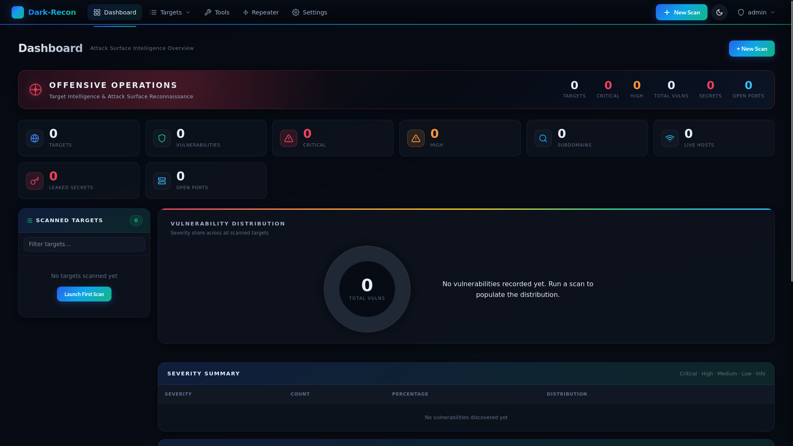
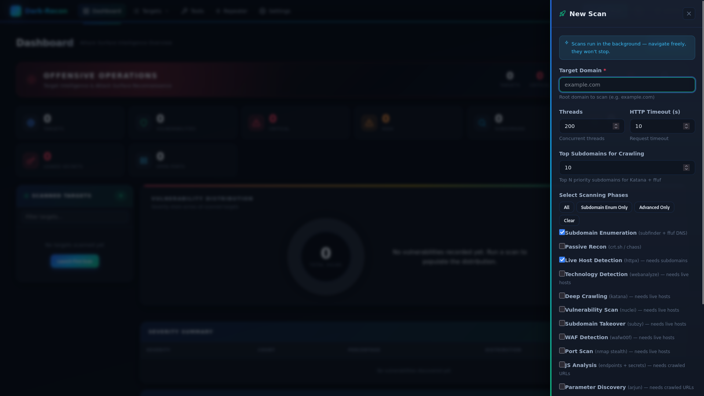
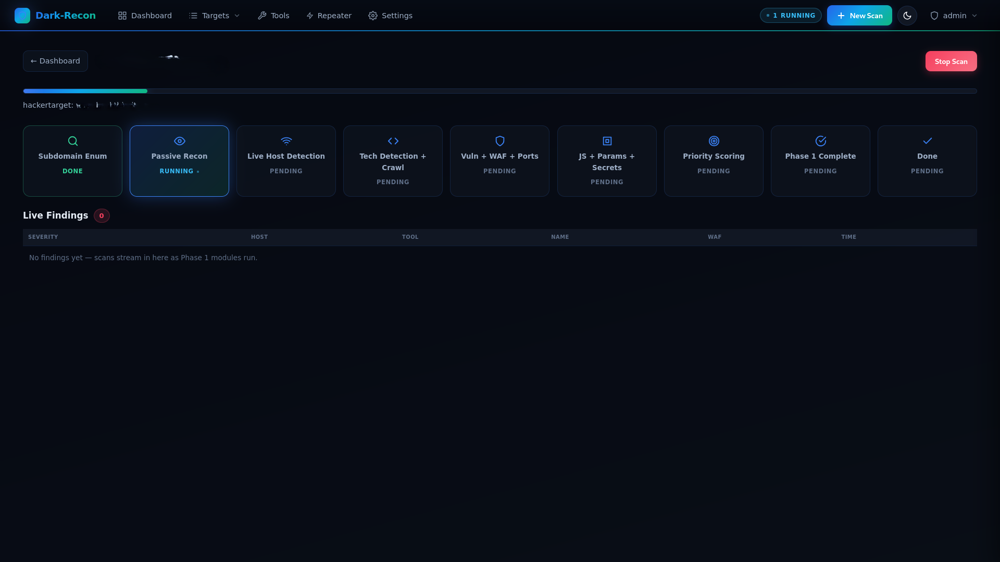
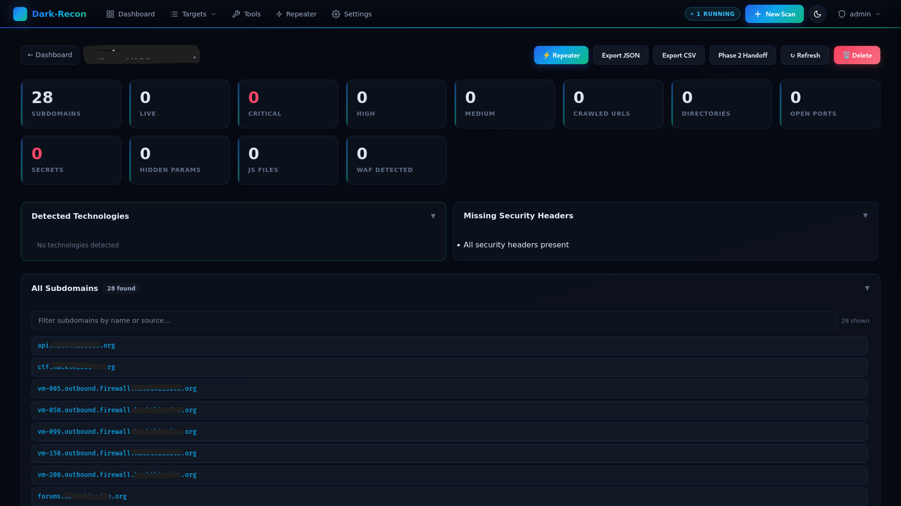
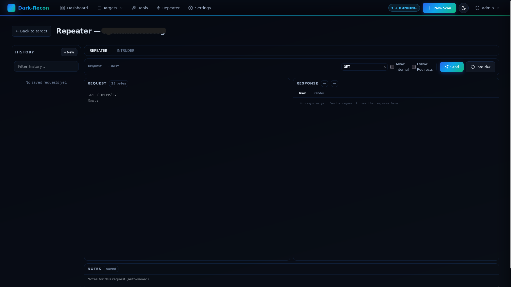

<div align="center">

# 🦇 Dark-Recon

### Automated Attack-Surface Reconnaissance Platform

**A single Go binary that runs the full Phase-1 recon lifecycle — subdomain discovery to a prioritized, exploitation-ready target list — with a live web UI, REST API, and MCP integration for LLM agents.**



</div>

---

## What is Dark-Recon?

Built out of the day-to-day grind of bug bounty hunting: which subdomain do I actually go after first, where are the live hosts, what did the crawler turn up, is there a WAF in the way — and once I've found something interesting, how do I poke at that one request without switching tools.

Give it a root domain and Dark-Recon orchestrates a multi-phase pipeline of industry-standard tools to map the entire external attack surface, then **ranks every finding by exploitability** so you know exactly where to attack first.

It's not a script wrapper. It's a full platform: concurrent pipeline engine, SQLite data layer, real-time web dashboard, REST API, a **built-in intercepting proxy** for manual request/response testing and proxy-driven bruteforcing, and an **MCP server so any LLM can drive the whole thing**.

> Manual recon is slow and inconsistent, raw tool output is noisy, and switching between a recon tool and a separate proxy breaks flow. Dark-Recon turns a domain into a **prioritized, evidence-backed target list** — with the tooling to pivot straight into manual testing — in minutes.

---

## Why Use It?

| You're tired of… | Dark-Recon gives you… |
|---|---|
| Running 8 tools by hand | One command → full automated pipeline |
| Unranked Nuclei findings | 0–100 priority score per subdomain, with *why* |
| No clear "attack first" target | Phase-2 handoff: top targets, params, vulns |
| Re-doing recon with no history | SQLite per-target DBs — resumable & queryable |
| Terminal-staring during long scans | Live web UI, WebSocket progress |
| Gluing tools into CI/LLM workflows | REST API + MCP server (Claude/Cursor/Cline) |
| Half-installed toolchains | Self-bootstrapping `.deb` with auto tool-install |
| `shell=True` recon scripts | No shell injection — `exec.Command` arg slices |
| Juggling a separate proxy tool | Built-in intercepting proxy — inspect & replay any request/response |
| Manually testing every parameter | Bruteforcing driven straight from the intercepted request |
| Not knowing which LLM you're stuck with | MCP server that works with any LLM client, not just one |

---

## Features

### Built for bug bounty triage
- **Subdomain prioritization** — every subdomain scored 0–100 across 7 factors so you know which one to chase first, not just a raw list
- **Crawled URL listing** — Katana crawl results (including JS-parsed endpoints) surfaced per target, with parameter-rich URLs flagged as injection surface
- **Live host / live IP detection** — httpx-driven, so you're never wasting time probing dead hosts
- **WAF detection** — wafw00f identifies the WAF in front of each host before you start firing payloads

### Built-in intercepting proxy
- **Inspect and modify every request/response** in-browser, no separate proxy tool needed
- **Proxy-driven bruteforcing** — fuzz parameters, headers, or paths directly from an intercepted request
- Findings from the proxy feed straight back into the same priority scoring and target dataset as the recon pipeline

### Core pipeline
- **8-phase orchestrator**, parallel where possible; Katana crawl feeds URLs into Nuclei
- **Resumable scans** — reuses prior subdomain/live-host/URL data
- **Single static binary** — embedded web UI, no CGO, no external assets
- **SQLite storage** (WAL mode) — 11 tables, one DB per target
- **REST API + MCP server** — full programmatic control, and any LLM client can drive it
- **Tool auto-installation** via `go install`, context-based cancellation
- **Opt-in advanced modules**: passive recon (crt.sh/HackerTarget/AlienVault/chaos), nmap port scan, WAF detection, JS analysis, param discovery (arjun), secret scanning (trufflehog/gitleaks)

**Priority scoring factors:** subdomain keywords (30) · vuln severity (35) · takeover (25) · exposed paths (20) · missing headers (15) · tech-stack risk (12) · param-rich URLs (10) — plus context-aware suggested manual tests.

---






## Tools It Drives

`subfinder` · `ffuf` · `httpx` · `webanalyze` · `katana` · `nuclei` · `subzy` (required) — auto-installed via `go install`.
Optional: `nmap`, `naabu`, `chaos`, `trufflehog`, `gitleaks`, `wafw00f`, `arjun`, `seclists`.

---

## Architecture

```
Browser / LLM Agent  →  API Layer + MCP  →  Scan Manager  →  Pipeline Engine
                                                                  │
                          enumeration → discovery → tech → nuclei → scoring
                                                                  │
                                            SQLite Storage (WAL, per-target)
```

---

## Installation

Ships as a single static binary — no external asset dirs.

```bash

# Option 1: build from source
git clone https://github.com/darkneuralnetwork/DarkRecon.git
cd DarkRecon
make build
./dark-recon -port 5000

# Option 2: .deb (recommended, Debian/Ubuntu) — auto-installs prereqs on first launch
```

Check tools/prereqs:
```bash
dark-recon prereqs                       # read-only status report
dark-recon prereqs --install             # install missing required tools
dark-recon prereqs --install --strict    # also install optional tools
```

**Requirements:** Linux (amd64/arm64) or macOS, `libc6`, ~50MB disk. Go only needed to install the security tools — the server binary itself is pre-built and static.

---

## Configuration

Three YAML files, editable via **Settings** page or `GET`/`PUT /api/config`:

- **`config.yaml`** — target, threads, timeouts, seclists paths, nuclei/katana settings, Phase-1 module toggles, priority keywords, exposed-path scores
- **`tools_config.yaml`** — enable/disable individual tools
- **`llm_config.yaml`** — LLM provider config for AI-assisted features (ollama/openai/etc.)

---

## Usage

```bash
./dark-recon -port 5000        # start server
dark-recon mcp                 # run MCP server over stdio (for LLM clients)
```

Then open `http://localhost:5000` → **New Scan** → enter target domain → configure modules → **Launch Scan** → watch live progress via WebSocket.

| Page | Route |
|---|---|
| Dashboard | `/` |
| Target Detail | `/target/{name}` |
| Live Progress | `/scan/{name}/progress` |
| Tools | `/tools` |
| Settings | `/settings` |

---

## API Reference (highlights)

| Method | Endpoint | Description |
|---|---|---|
| `POST` | `/api/scan/launch` | Launch a scan |
| `GET` | `/api/scan/{target}/status` | Scan status |
| `GET` | `/api/target/{target}` | Full target dataset |
| `GET` | `/api/target/{target}/priority` | Priority ranking |
| `GET` | `/api/target/{target}/handoff` | Phase-2 handoff |
| `GET` | `/api/phase1/{target}/findings` | Phase-1 advanced module findings |
| `GET`/`PUT` | `/api/config` | Get/update configuration |
| `GET` | `/api/tools` | Tool install status |
| `ws://localhost:5000/ws/{target}` | Live progress WebSocket |

Full route list (29 endpoints) lives in `internal/api/routes.go`.

---

## MCP / LLM Integration

The binary doubles as an MCP server — a thin stdio wrapper over the REST API — so **any MCP-compatible LLM client** (Claude Desktop, Cursor, Cline, or your own agent) can drive scans, read findings, and interact with the proxy, not just one specific model.

```bash
dark-recon -port 5000 &
dark-recon mcp
```

**Claude Desktop config:**
```json
{
  "mcpServers": {
    "dark-recon": { "command": "dark-recon", "args": ["mcp"] }
  }
}
```

Exposed tools: `launch_scan`, `wait_for_scan`, `get_priority`, `get_handoff`, `get_vulnerabilities`, `list_tools`, `install_tool`, `update_config`, and more.

Example prompt: *"Launch a recon scan against example.com, wait for it to finish, and give me the top 5 priority targets with reasons."*

---

## Output & Database

```
<target>/
├── scan.db
├── raw/            # subfinder, ffuf, httpx, katana, nuclei, webanalyze, subzy
├── parsed/         # subdomains, live hosts, URLs
├── priority/       # priority_ranking.json, phase2_handoff.json
├── reports/report.json
└── screenshots/
```
default login credential 
  admin:admin 
  
11 SQLite tables (WAL mode, single-writer): `scan_meta`, `subdomains`, `live_hosts`, `tech_detections`, `crawled_urls`, `discovered_dirs`, `vulnerabilities`, `takeover_results`, `screenshots`, `priority_entries`, `header_results`.

---

## Security

- No shell injection — `exec.CommandContext` with arg slices, never a shell
- Path traversal protected via `filepath.Join()`
- Per-tool `context.WithTimeout`; cancellable via `context.CancelFunc`
- Single-writer SQLite (WAL + `MaxOpenConns(1)`)
- Truncated tool output in logs
- Robust tool-availability checks (catches half-installed/zero-byte binaries)

---

## Development

```bash
make build   make run   make mcp
make test    make fmt   make vet
make check-prereqs   make install-tools   make deb   make clean
```

**Dependencies:** `gorilla/websocket`, `modelcontextprotocol/go-sdk`, `yaml.v3`, `modernc.org/sqlite` (pure-Go, no CGO).

**Structure:**
```
cmd/dark-recon/         # entry point
internal/
  api/ config/ enumeration/ discovery/ technology/ direnum/
  nuclei/ takeover/ scoring/ scanmgr/ pipeline/ phasemod/
  installer/ mcp/ storage/
pkg/executor/ pkg/parser/ pkg/logger/
dark_recon/ui/          # embedded HTML + static assets
scripts/ dist/
```

---

## License & Disclaimer

For **authorized security testing and educational use only**. Get written authorization before scanning any target you don't own. Authors aren't responsible for misuse.

---

<div align="center">

**Dark-Recon v1.0.0** — from domain → prioritized attack plan, in minutes.

</div>
